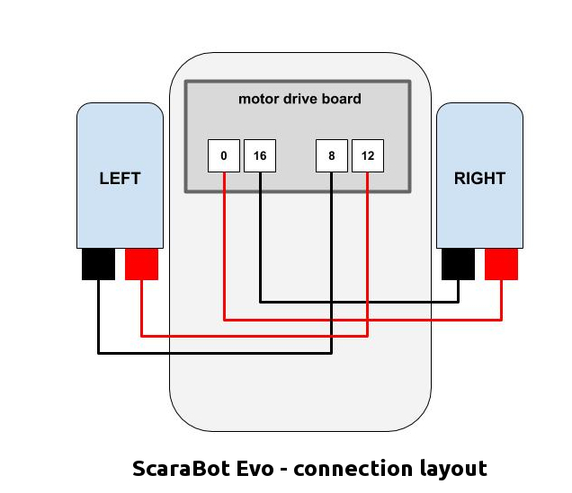

# ScaraBot Evo
ScaraBot Evolution is a drawing DIY robot controlled by microbit
The ScaraBot Evo is formed by two main parts:
- ScaraBot EVO robot
- ScaraBot Radio Controller

# Components
The build a ScaraBot EVO Robot you need:
- 2 x DC motors
- 2 x Right Angle Geared Hobby Motor
- 2 x Wheel for Geared Hobby Motor
- 1 X Steel Ball Caster 
- 1 x microbit card for Robot
- 1 x Motor Drive board for microbit
- 1 x 4.5 - 6V Power Supply  
- 1 x Servo motor
- 1 DIY Chassis
- Screws, wires and jumpers

Options
- 1 x OLED
- 1 x DIY holder

You also need
- 1 x microbit card for ScaraBot Radio Contoller

# Wiring

The wiring diagram between the microbit's pins and the motors

