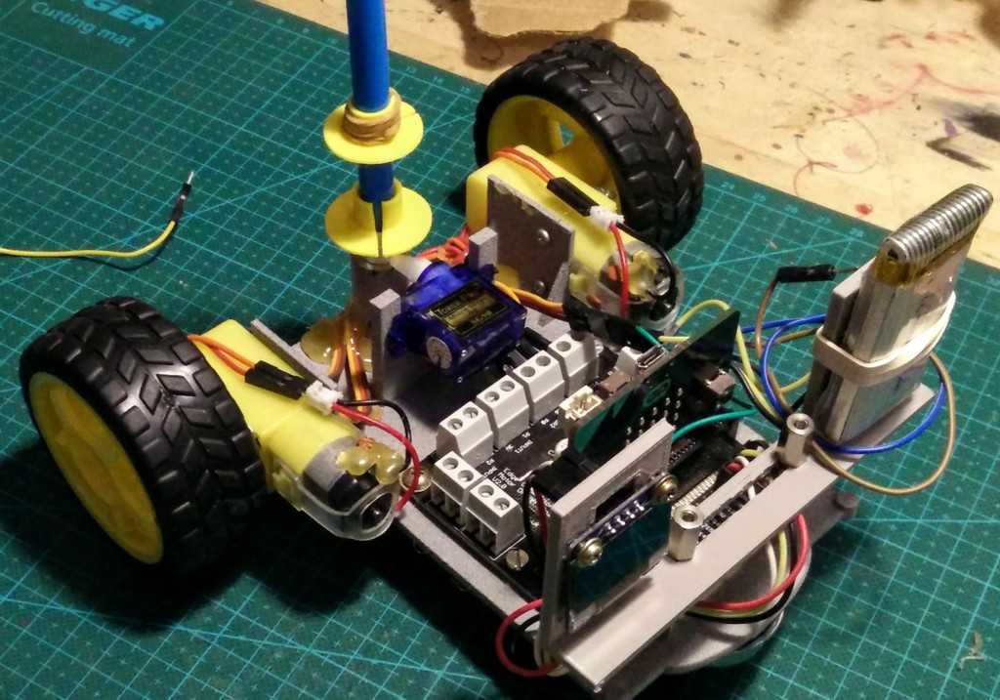

# ScaraBot Evo
ScaraBot Evolution is a **drawing DIY robot controlled by a BBC microbit card**.

It has a pen holder cylinder, where you can insert a marker pen.
A servo motor is used to control the pen lift.
To allow up and down movement, the pen must have a thick ring that comes into contact with the servo motor arm.

ScaraBot Evo has also an OLED display to shows messages

# Features

The ScaraBot Evo is formed by two main parts:
- **ScaraBot EVO robot**
- **ScaraBot Radio Controller**

ScaraBot EVO can make  drawings in two ways

## Remote radio control

ScaraBot Evo can be remote-controlled by a second microbit, the ScaraBot Radio Controller, through radio frequency communication. 
The **ScaraBot Radio Controller** is like a joypad and depending by how you move it, it sends specifics radio commands to the ScaraBot Evo Robot; for instance: if you roll-down the ScaraBot Radio Controller, it sends the "forward" message to ScaraBot EVO robot.

## Programming 
You can create and updload a specific program into the micobit to generate the desired drawings. I have created a library of motor's commands to reduce your coding time, and making it easier. You don't need to think about wich PIN has to be set on/off to obtain a specific movement: just drag the block function you need.

# Components
The build a ScaraBot EVO Robot you need:
- 2x DC motors
- 2x Right Angle Geared Hobby Motor
- 2x Wheel for Geared Hobby Motor
- 1x Steel Ball Caster 
- 1x microbit card for Robot
- 1x Motor Drive board for microbit
- 1x 4.5 - 6V Power Supply  
- 1x Servo motor
- 1x DIY Chassis
- Screws, wires and jumpers

Options
- 1x OLED
- 1x DIY holder

You also need:
- 1x microbit card for ScaraBot Radio Contoller

# Wiring

The wiring diagram between the microbit's pins and the motors

# Chassis

The ScaraBot's chassis has been designed with Tinkercad and 3D printed

You can download the [STL file](https://github.com/cyberparra/Scarabotevo/blob/master/ScaraBot%20EVO.stl) ready to be printed  
