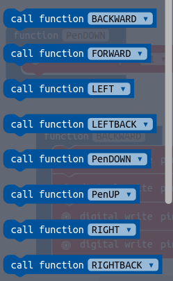

# ScaraBot Evo
ScaraBot Evolution is a **drawing DIY robot controlled by a BBC microbit card**.

It has a pen holder cylinder, where you can insert a marker pen.
A servo motor is used to control the pen lift.
To allow up and down movement, the pen must have a thick ring that comes into contact with the servo motor arm.

ScaraBot Evo has also an OLED display to shows messages

# Features

The ScaraBot Evo is formed by two main parts:
- **ScaraBot EVO robot**
- **ScaraBot Radio Controller**

ScaraBot EVO can make  drawings in two ways

## Remote radio control

ScaraBot Evo can be remote-controlled by a second microbit, the **ScaraBot Radio Controller**, through radio frequency communication. 
The **ScaraBot Radio Controller** is like a joypad and depending by how you move it, it sends specifics radio commands to the ScaraBot Evo Robot; for instance: if you roll-down the ScaraBot Radio Controller, it sends the "forward" message to ScaraBot EVO robot.

In order to use the ScaraBot in the _radio-controlled mode_ you need to:
1. upload [this ScaraBotEvo.hex code](https://github.com/cyberparra/Scarabotevo/blob/master/microbit-ScarabotEvo.hex) into ScaraBot EVO Robot
2. upload [this ScaraBotController.hex code ](https://github.com/cyberparra/Scarabotevo/blob/master/microbit-ScarabotController.hex) into ScaraBot Radio Contoller

## Programming 
You can create and upload a specific program into the micobit to generate the desired drawings. I have created a library of motor's commands to reduce your coding time, and making it easier. You don't need to think about wich PIN has to be set on/off to obtain a specific movement: just drag the block function you need.

Here an example of programmed ScaraBot EVO in action: https://youtu.be/HeQIrRYyBCM

In order to use the ScaraBot in the _programming mode_ you can use [this motors library.hex code](https://github.com/cyberparra/Scarabotevo/blob/master/microbit-ScarabotEVO-motors-library.hex) 

# Components
The build a ScaraBot EVO Robot you need:
- 2x DC motors
- 2x Right Angle Geared Hobby Motor
- 2x Wheel for Geared Hobby Motor
- 1x Steel Ball Caster 
- 1x microbit card for Robot
- 1x Motor Drive board for microbit
- 1x 4.5 - 6V Power Supply  
- 1x Servo motor
- 1x DIY Chassis and Ring for the pen
- Screws, wires and jumpers

Options
- 1x OLED Display
- 1x DIY OLED holder

You also need:
- 1x microbit card for ScaraBot Radio Contoller

# Wiring

The wiring diagram between the microbit's pins and the motors

# OLED Display

The ScaraBot EVO has an OLED display to show messages and data. You can modify the program and decide which messages/data to display and when.

The OLED display connects to Microbit using four wires:

* two for power
  * +3V to PIN 18
  * GND to PIN 21
* two for data
  * SCL to PIN 19
  * SDA to PIN 20

## Coding the OLED

In order to program the OLED, you must to add a package inside the microbit.
Got to _Add Package_ menu inside the _makecode.microbit_ editor and look for tinkeracademy-tinker-kit-

When this package is installed a new OLED category appears with several new coding blocks inside it

# 3D parts

## Chassis

The ScaraBot's chassis has been designed with Tinkercad and 3D printed

You can download the [3D file (STL)](https://github.com/cyberparra/Scarabotevo/blob/master/ScaraBot%20EVO.stl) ready to be printed, or design your own chassis

## Ring

In order to lift the pen on and off, the pen should have a thicker part in the middle that can be touched by servo motor's arm. To do that I have designed a cylindrical ring with a larger disk on the base.

The marker pen has to be inserted inside the  ring; a rubber band around the ring will allow it to stick to the pen.

Here is the [Pen Ring 3D file](https://github.com/cyberparra/Scarabotevo/blob/master/penring.stl) 

## OLED Holder

The OLED display can be mounted on this holder which can also host the LIPO battery, as in my case.

Here is the [OLED Holder 3D file](https://github.com/cyberparra/Scarabotevo/blob/master/OLEDholder.stl) 

